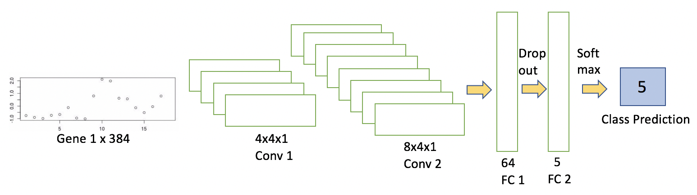
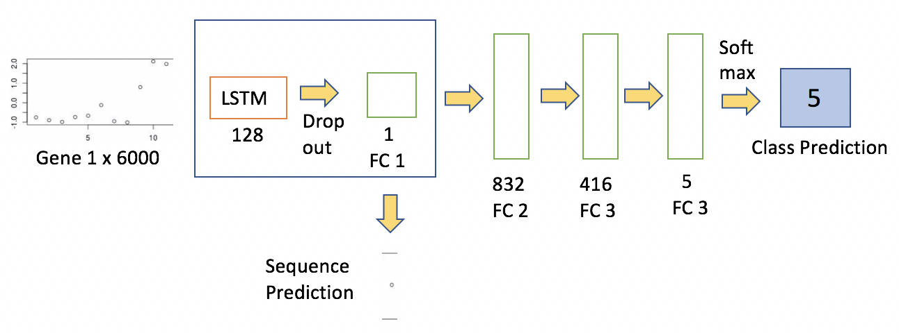
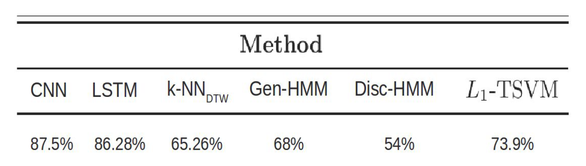

# From SVM to LSTM: Classification of Time Series Gene Expression Data

To classify *Saccharomyces cerevisiae* time series gene expression profiles
into the 5 mitotic cell cycle phases - Early G1, Late G1, S, G2, M.

* [Poster](poster.pdf)
* [Report](report.pdf)

## Introduction

* Time series microarray experiments generate labelled temporal profiles which are
suitable for the following tasks:
 * Classification of unlabelled time course expression data.
 * Identification of dynamic biological networks.
* Classification finds motivation most importantly in clinical applications where
prediction of a patient's response to a drug treatment is crucial for timely alteration
of therapeutic strategies.
* We implemented a novel CNN and LSTM, and compared the performance against
a temporal SVM, HMM and kNNDTW.

## Methods

1. 1-D Convolutional Neural Net:
 * `nn_code/cnn_timeseries.py`

2. Long Short-Term Memory Network with Convolutional
Networks: 
 * `nn_code/lstm.py`
 

3. K-Nearest Neighbors with
Dynamic Warping Distance: 
 * `DTW_kNN.py`

4. Generative-Hidden Markov Model and Discriminative-Hidden Markov Model developed by Z.
Bar-Joseph et al.: 
 * `tram/`
 * The code for this was downloaded from their paper and used as is.
 * Links to paper and original code:
   * https://www.ncbi.nlm.nih.gov/pmc/articles/PMC2718630/
   * http://www.cs.cmu.edu/$sim%20$thlin/tram/

5. L1-norm Temporal SVM developed by Orsenigo et al.:
 * Baseline benchmark.
 * Link to paper:
   * https://link.springer.com/content/pdf/10.1007%2F978-3-642-16001-1_23.pdf

## Dataset
http://genomics.stanford.edu/yeast_cell_cycle/cellcycle.html

## Results

